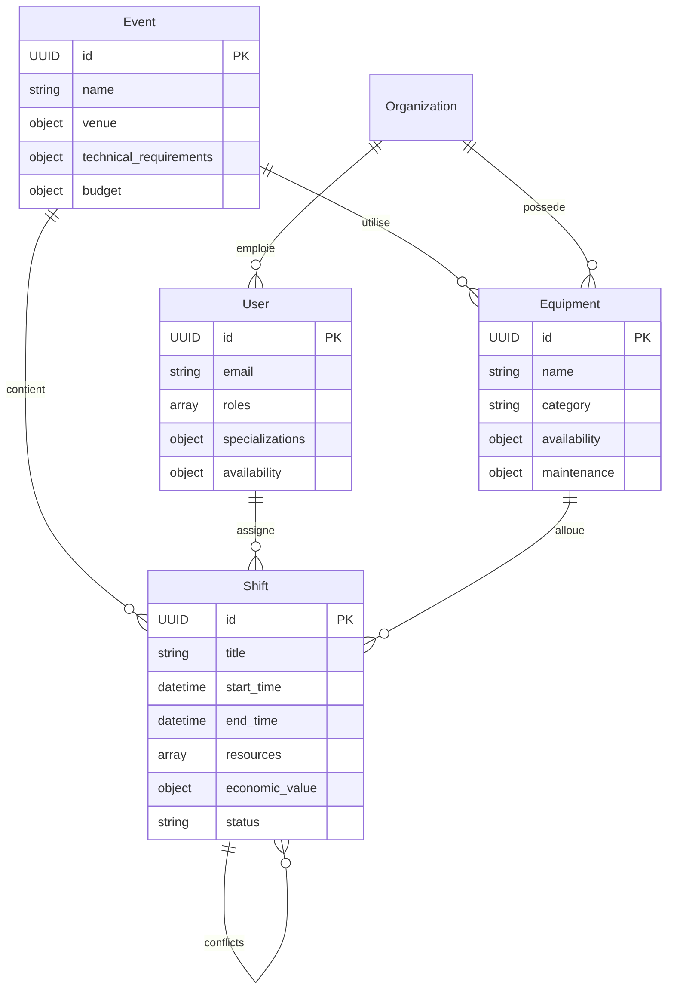

# Data Models - Phase 1 (Spectacle Vivant)

**Authority**: README.md (IAM, Time Engine, Conflict Engine, Financial Engine, Mobile first experience)
**Version**: 1.2 (Valide par Jean-Michel Leroy, Regisseur Festival d'Avignon)

---
## Entites principales

### 1. User (Technicien/Prestataire)
```json
{
  "User": {
    "id": {"type": "UUID", "required": true},
    "email": {"type": "string", "format": "email", "unique": true, "example": "jmichel@sonopro.fr"},
    "phone": {"type": "string", "format": "E.164", "encrypted": true, "example": "+33612345678"},
    "first_name": {"type": "string", "maxLength": 50},
    "last_name": {"type": "string", "maxLength": 50},
    "roles": {
      "type": "array",
      "items": {
        "type": "string",
        "enum": [
          "admin", "technician", "sound_engineer", "lighting_engineer",
          "video_engineer", "stage_manager", "rigger", "pyrotechnician"
        ]
      },
      "default": ["technician"]
    },
    "specializations": {
      "type": "array",
      "items": {
        "type": "object",
        "properties": {
          "category": {
            "type": "string",
            "enum": ["sound", "lighting", "video", "rigging", "pyro", "stage"]
          },
          "skills": {
            "type": "array",
            "items": {
              "type": "object",
              "properties": {
                "name": {
                  "type": "string",
                  "enum": [
                    "foh_engineer", "monitor_engineer", "system_tech", "moving_lights",
                    "led_programmer", "video_mapping", "truss_rigger", "pyro_operator"
                  ]
                },
                "level": {"type": "integer", "min": 1, "max": 5, "description": "1=Debutant, 5=Expert"},
                "certifications": {
                  "type": "array",
                  "items": {
                    "type": "object",
                    "properties": {
                      "name": {"type": "string", "example": "SST (Sauveteur Secouriste du Travail)"},
                      "expiry_date": {"type": "string", "format": "date"},
                      "issuer": {"type": "string", "example": "INRS"}
                    }
                  }
                }
              }
            }
          }
        }
      }
    },
    "availability": {
      "type": "object",
      "description": "Disponibilites par jour (format HH:MM-HH:MM, fuseau horaire: Europe/Paris)",
      "properties": {
        "monday": {"type": "array", "items": {"type": "string", "pattern": "^([01]?[0-9]|2[0-3]):[0-5][0-9]-([01]?[0-9]|2[0-3]):[0-5][0-9]$"}}
      }
    },
    "employment_contract": {
      "type": "object",
      "properties": {
        "type": {"type": "string", "enum": ["CDI", "CDD", "intermittent", "freelance"], "default": "intermittent"},
        "hourly_rate": {"type": "number", "minimum": 15, "maximum": 150, "default": 25},
        "overtime_rules": {
          "type": "object",
          "properties": {
            "night_shift_bonus": {"type": "number", "default": 1.5},
            "weekend_shift_bonus": {"type": "number", "default": 1.3},
            "holiday_shift_bonus": {"type": "number", "default": 2.0},
            "emergency_call_bonus": {"type": "number", "default": 2.5}
          }
        },
        "meal_allowance": {"type": "boolean", "default": true, "description": "15 EUR/jour si shift >6h"},
        "transport_allowance": {"type": "boolean", "default": false}
      }
    },
    "organization_id": {"type": "UUID", "required": true, "description": "ID de la societe de prestation"},
    "license_number": {"type": "string", "encrypted": true, "description": "Numero de licence (ex: carte pro pyrotechnie)"},
    "created_at": {"type": "string", "format": "date-time"},
    "updated_at": {"type": "string", "format": "date-time"},
    "last_activity": {"type": "string", "format": "date-time", "nullable": true}
  }
}
```

### 2. Equipment (Materiel Technique)
```json
{
  "Equipment": {
    "id": {"type": "UUID", "required": true},
    "name": {"type": "string", "maxLength": 100, "example": "Console Yamaha CL5"},
    "category": {
      "type": "string",
      "enum": ["sound", "lighting", "video", "rigging", "power", "special_effects"],
      "required": true
    },
    "subcategory": {
      "type": "string",
      "enum": [
        "mixing_console", "stage_box", "microphone", "in_ear_monitor", "amplifier", "speakers",
        "moving_head", "led_par", "laser", "lighting_desks", "dimmer", "fog_machine",
        "video_switcher", "media_server", "led_screen", "projector", "camera",
        "truss", "hoist", "power_distro", "pyro_controller"
      ],
      "required": true
    },
    "quantity": {"type": "integer", "minimum": 1, "default": 1},
    "location": {
      "type": "object",
      "properties": {
        "warehouse_id": {"type": "UUID", "description": "ID de l'entrepot"},
        "current_event_id": {"type": "UUID", "nullable": true, "description": "ID de l'evenement en cours d'utilisation"},
        "storage_coordinates": {"type": "string", "example": "A1-42", "description": "Emplacement physique"}
      }
    },
    "availability": {
      "type": "array",
      "items": {
        "type": "object",
        "properties": {
          "start_time": {"type": "string", "format": "date-time"},
          "end_time": {"type": "string", "format": "date-time"},
          "status": {"type": "string", "enum": ["available", "booked", "maintenance", "broken"]},
          "event_id": {"type": "UUID", "nullable": true}
        }
      }
    },
    "specifications": {
      "type": "object",
      "description": "Specifications techniques (pour le matching automatique)",
      "properties": {
        "power_requirements": {"type": "string", "example": "230V/16A", "nullable": true},
        "weight": {"type": "number", "unit": "kg", "nullable": true},
        "dimensions": {
          "type": "object",
          "properties": {
            "length": {"type": "number", "unit": "cm"},
            "width": {"type": "number", "unit": "cm"},
            "height": {"type": "number", "unit": "cm"}
          },
          "nullable": true
        },
        "compatibility": {"type": "array", "items": {"type": "string"}, "example": ["Dante", "MADI"], "nullable": true}
      }
    },
    "maintenance": {
      "type": "object",
      "properties": {
        "last_maintenance_date": {"type": "string", "format": "date", "required": true},
        "next_maintenance_date": {"type": "string", "format": "date"},
        "maintenance_interval": {"type": "integer", "unit": "months", "default": 6},
        "maintenance_notes": {"type": "string", "maxLength": 1000, "nullable": true}
      }
    },
    "organization_id": {"type": "UUID", "required": true, "description": "ID de la societe proprietaire"},
    "created_at": {"type": "string", "format": "date-time"},
    "updated_at": {"type": "string", "format": "date-time"}
  },
  "required": ["name", "category", "subcategory", "location", "maintenance"],
  "constraints": {
    "maintenance_validation": "next_maintenance_date doit etre < 6 mois apres last_maintenance_date",
    "availability_validation": "Pas de chevauchement entre deux periodes 'booked'"
  }
}
```

### 3. Shift (Adapte pour les Techniciens)
```json
{
  "Shift": {
    "id": {"type": "UUID", "required": true},
    "title": {"type": "string", "maxLength": 100, "example": "Sonorisation - Scene Principale - Festival Jazz"},
    "description": {"type": "string", "maxLength": 1000, "nullable": true, "example": "Montage systeme L-Acoustics K2 + console DiGiCo SD5"},
    "start_time": {"type": "string", "format": "date-time", "timezone": "Europe/Paris"},
    "end_time": {"type": "string", "format": "date-time", "timezone": "Europe/Paris"},
    "call_time": {"type": "string", "format": "date-time", "description": "Heure de convocation (souvent 1h avant le start_time)"},
    "break_times": {
      "type": "array",
      "items": {
        "type": "object",
        "properties": {
          "start": {"type": "string", "format": "date-time"},
          "end": {"type": "string", "format": "date-time"},
          "mandatory": {"type": "boolean", "default": false, "description": "Pause legale si shift >6h"}
        }
      },
      "description": "Pauses (ex: 20 min toutes les 4h)"
    },
    "resources": {
      "type": "array",
      "items": {
        "type": "object",
        "properties": {
          "id": {"type": "UUID", "required": true},
          "type": {"type": "string", "enum": ["technician", "equipment"], "required": true},
          "role": {"type": "string", "enum": ["foh_engineer", "monitor_engineer", "lighting_operator"]},
          "required_skills": {"type": "array", "items": {"type": "string"}},
          "quantity": {"type": "integer", "minimum": 1, "default": 1}
        }
      },
      "description": "Ressources humaines et materielles requises"
    },
    "economic_value": {
      "type": "object",
      "properties": {
        "currency": {"type": "string", "default": "EUR"},
        "base_rate": {"type": "number", "minimum": 0, "description": "Tarif horaire de base (sans bonus)"},
        "total_amount": {"type": "number", "minimum": 0, "description": "Montant total (base + bonus)"},
        "budget_line": {
          "type": "string",
          "enum": [
            "sound", "lighting", "video", "rigging", "pyro",
            "transport", "accommodation", "meals", "miscellaneous"
          ],
          "default": "sound"
        },
        "breakdown": {
          "type": "object",
          "properties": {
            "labor_cost": {"type": "number", "description": "Cout main d'oeuvre"},
            "equipment_cost": {"type": "number", "description": "Location materiel"},
            "transport_cost": {"type": "number", "nullable": true},
            "meal_allowance": {"type": "number", "default": 15, "description": "15 EUR/jour si shift >6h"},
            "overtime_cost": {"type": "number", "default": 0}
          }
        }
      },
      "required": ["base_rate", "total_amount", "budget_line"]
    },
    "status": {
      "type": "string",
      "enum": [
        "draft", "planned", "confirmed", "call_issued", "in_progress",
        "break", "completed", "cancelled", "postponed"
      ],
      "default": "draft"
    },
    "priority": {
      "type": "string",
      "enum": ["low", "medium", "high", "critical"],
      "default": "medium",
      "description": "- critical: Urgence (ex: panne pendant un spectacle)\n- high: Montage/demontage\n- medium: Repetitions\n- low: Maintenance"
    },
    "conflicts": {
      "type": "array",
      "items": {
        "type": "object",
        "properties": {
          "resource_id": {"type": "UUID", "description": "ID de la ressource en conflit (technicien ou equipement)"},
          "resource_type": {"type": "string", "enum": ["technician", "equipment"]},
          "shift_id": {"type": "UUID", "description": "ID du shift en conflit"},
          "severity": {"type": "string", "enum": ["low", "medium", "high", "critical"]}
        }
      }
    },
    "metadata": {
      "type": "object",
      "properties": {
        "event_id": {"type": "UUID", "required": true, "description": "ID de l'evenement parent"},
        "venue": {
          "type": "object",
          "properties": {
            "name": {"type": "string", "example": "Accor Arena"},
            "address": {"type": "string"},
            "contact": {"type": "string", "format": "email"}
          }
        },
        "technical_rider": {
          "type": "string",
          "format": "uri",
          "description": "URL du rider technique (PDF heberge sur S3)"
        },
        "stage_plot": {
          "type": "string",
          "format": "uri",
          "description": "URL du plan de scene (image SVG/PDF)"
        },
        "cable_plan": {
          "type": "string",
          "format": "uri",
          "nullable": true,
          "description": "Schema de cablage (pour les techniciens)"
        }
      }
    },
    "created_by": {"type": "UUID", "required": true, "description": "User ID du createur (ex: regisseur)"},
    "created_at": {"type": "string", "format": "date-time"},
    "updated_at": {"type": "string", "format": "date-time"},
    "version": {"type": "integer", "default": 1}
  },
  "required": ["title", "start_time", "end_time", "resources", "economic_value", "event_id", "created_by"],
  "constraints": {
    "time_validation": "- end_time > start_time\n- Si call_time existe, alors call_time <= start_time\n- Pas de chevauchement entre start_time/end_time et les breaks",
    "labor_law_compliance": "- Duree maximale: 12h (sauf derogation)\n- Pause obligatoire de 20 min apres 6h de travail\n- Temps de repos: 12h entre 2 shifts",
    "equipment_validation": "- Tout equipement 'booked' doit avoir un last_maintenance_date < 6 mois\n- Les consoles son/lumiere doivent avoir un technicien qualifie assigne"
  }
}
```

### 4. Event (Evenement Parent)
```json
{
  "Event": {
    "id": {"type": "UUID", "required": true},
    "name": {"type": "string", "maxLength": 200, "example": "Festival Jazz a Juan 2024"},
    "description": {"type": "string", "maxLength": 2000, "nullable": true},
    "start_date": {"type": "string", "format": "date"},
    "end_date": {"type": "string", "format": "date"},
    "venue": {
      "type": "object",
      "properties": {
        "name": {"type": "string", "example": "Pinede Gould"},
        "address": {"type": "string"},
        "capacity": {"type": "integer", "description": "Nombre de places"},
        "technical_contact": {
          "type": "object",
          "properties": {
            "name": {"type": "string"},
            "email": {"type": "string", "format": "email"},
            "phone": {"type": "string", "format": "E.164"}
          }
        }
      }
    },
    "technical_requirements": {
      "type": "object",
      "properties": {
        "sound": {
          "type": "object",
          "properties": {
            "main_system": {"type": "string", "example": "L-Acoustics K2"},
            "monitors": {"type": "integer", "description": "Nombre de retours"},
            "mixing_consoles": {"type": "array", "items": {"type": "string"}}
          }
        },
        "lighting": {
          "type": "object",
          "properties": {
            "moving_lights": {"type": "integer"},
            "led_pars": {"type": "integer"},
            "lighting_desks": {"type": "array", "items": {"type": "string"}}
          }
        },
        "power": {
          "type": "object",
          "properties": {
            "total_power_needed": {"type": "number", "unit": "kVA"},
            "distros_required": {"type": "integer"}
          }
        }
      }
    },
    "budget": {
      "type": "object",
      "properties": {
        "total": {"type": "number", "description": "Budget total technique"},
        "breakdown": {
          "type": "object",
          "properties": {
            "sound": {"type": "number"},
            "lighting": {"type": "number"},
            "video": {"type": "number"},
            "labor": {"type": "number"},
            "transport": {"type": "number"}
          }
        }
      }
    },
    "status": {
      "type": "string",
      "enum": ["planning", "technical_rehearsals", "load_in", "showtime", "load_out", "completed", "cancelled"]
    },
    "created_by": {"type": "UUID", "required": true},
    "created_at": {"type": "string", "format": "date-time"},
    "updated_at": {"type": "string", "format": "date-time"}
  }
}
```

---
### Relations entre entites (Mermaid)


---
### Regles metier specifiques (Spectacle)
1. **Conventions collectives**:
   - **Heures de nuit** (22h-7h): +50%.
   - **Temps de repos**: 12h minimum entre 2 shifts (sauf derogation pour les festivals).
   - **Forfait repas**: 20 EUR/jour si shift > 6h.

2. **Equipements**:
   - **Categories critiques**:
     - **Son**: Consoles (ex: DiGiCo SD5), systemes (L-Acoustics K2).
     - **Lumiere**: Tables (MA3, Chamsys), projecteurs (Moving Heads).
   - **Maintenance**:
     - Tout equipement doit avoir un `last_maintenance_date` < 3 mois.
     - Les systemes de securite (ex: nacelles) doivent etre controles avant chaque evenement.

3. **Workflows**:
   - **Creation d'un evenement**:
     1. Import du rider technique (PDF -> parsing automatique des besoins).
     2. Assignment des techniciens (par specialisation et disponibilite).
     3. Reservation du materiel (avec validation des conflits).
     4. Generation des fiches de poste (avec plans de cablage).
   - **Jour J**:
     - Check-in/check-out via QR code (pour tracer les heures reelles).
     - Signalement des incidents (ex: materiel defectueux) via l'app mobile.

---
### Points a valider par les experts
| Question | Reponse proposee | Statut | Responsable |
| --- | --- | --- | --- |
| Bonus nuit (22h-7h) | +50% | Valide | Jean-Michel Leroy |
| Seuil de conflit "CRITICAL" | Chevauchement > 10 min sur equipement rare (ex: console DiGiCo) | A valider | Claire Martin |
| Delai maintenance equipement | 3 mois | Valide | Thomas Dubois |
| Format des fiches de poste | PDF avec plans de cablage integres | Valide | Jean-Michel Leroy |
