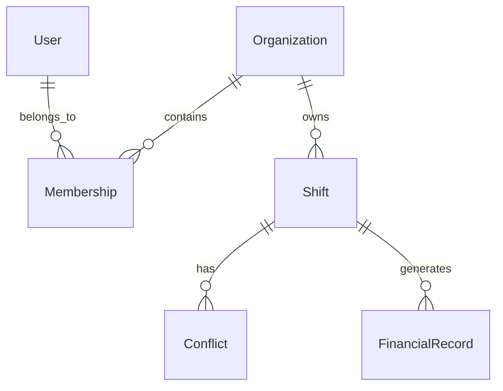

# Data Models - Phase 1

**Authority**: README.md (IAM, Time Engine, Conflict Engine, Financial Engine, Mobile First)

## Objectif
Definir des schemas de donnees **minimaux** pour demarrer la Phase 1 sans inventer de fonctionnalites hors README.md. Les champs marques "A valider" requierent une decision humaine.

---

## Entites principales

### 1) User
Reference: IAM (README.md)

```json
{
  "User": {
    "id": "UUID",
    "email": "string (A valider: format + chiffrement)",
    "phone": "string (A valider: format + chiffrement)",
    "roles": ["admin", "manager", "employee", "auditor"],
    "competences": ["string"],
    "disponibilites": {"monday": ["time-range"], "...": []},
    "reputation": "number (A valider: echelle)",
    "created_at": "date-time",
    "updated_at": "date-time"
  }
}
```

### 2) Membership
Reference: IAM (User <-> Membership <-> Roles)

```json
{
  "Membership": {
    "id": "UUID",
    "user_id": "UUID",
    "organization_id": "UUID",
    "roles": ["string"],
    "status": "string (A valider)",
    "created_at": "date-time"
  }
}
```

### 3) Organization
Reference: Multi org (README.md Phase 4), mais necessaire pour Phase 1 (identite + permissions)

```json
{
  "Organization": {
    "id": "UUID",
    "name": "string",
    "timezone": "string",
    "created_at": "date-time"
  }
}
```

### 4) Shift
Reference: Time and Reservation Engine

```json
{
  "Shift": {
    "id": "UUID",
    "title": "string",
    "start_time": "date-time (UTC)",
    "end_time": "date-time (UTC)",
    "resource_assignment": {"resource_id": "UUID", "resource_type": "string"},
    "economic_value": {"currency": "string", "amount": "number"},
    "timezone": "string",
    "recurrence_rule": "string (RRULE)",
    "buffers": {"before_minutes": "int", "after_minutes": "int"},
    "travel": {"enabled": "bool", "metadata": "object"},
    "status": "string (workflow minimal)",
    "created_by": "UUID",
    "created_at": "date-time",
    "updated_at": "date-time"
  }
}
```

### 5) Conflict
Reference: Conflict Detection and Resolution Engine

```json
{
  "Conflict": {
    "id": "UUID",
    "shift_id": "UUID",
    "conflict_type": "enum (CRITICAL|HIGH|MEDIUM|LOW)",
    "rule": "string (ex: double_booking_same_org)",
    "created_at": "date-time",
    "resolved_at": "date-time (nullable)"
  }
}
```

### 6) FinancialRecord
Reference: Financial Intelligence Engine

```json
{
  "FinancialRecord": {
    "id": "UUID",
    "shift_id": "UUID",
    "organization_id": "UUID",
    "type": "enum (estimated|actual)",
    "amount": "number",
    "currency": "string",
    "created_at": "date-time"
  }
}
```

---

## Relations (MVP)


---

## Gouvernance des donnees
Reference: Security and Compliance Framework (README.md)

1. **Chiffrement**
   - Donnees sensibles (PII) chiffrees au repos (AES-256).
   - TLS 1.3 en transit.

2. **Audit trail**
   - Toute modification de roles, permissions et statuts doit etre loguee.

3. **Retention**
   - Duree a valider selon les exigences RGPD et obligations legales.

---

## Points a valider (humain requis)
- Champs obligatoires et contraintes (ex: end_time > start_time).
- Echelle de reputation et regles de calcul.
- Workflow minimal pour `Shift.status`.
- Regles exactes des conflits et their mapping aux priorites.
